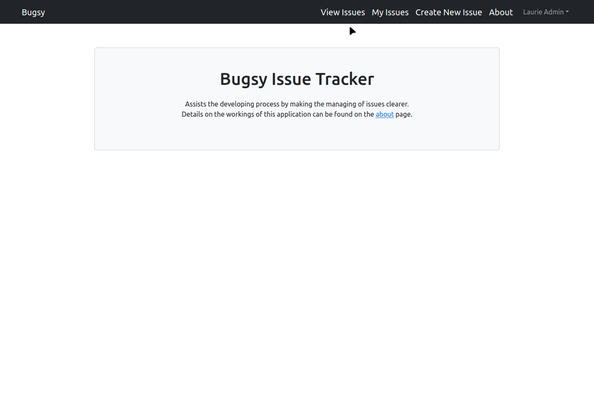

# Bugsy Bug Tracker

This is a SPA (Single Page Application) full-stack bug tracker built with the MERN stack. 



It allows the management of bugs by CRUD operations; user authentication using JWT and bcryptjs; offers data persistence with MongoDB; manages application state with Redux. 

---

## Deployment

Deployed with Render:

https://bugsy-front.onrender.com/

## Backend link

https://github.com/carlos-silva-1/Bugsy-Server

---

## Built With

- MongoDB
- Express
- React
- Node
- Redux

---

## Software Requirements Specification

### 1. Introduction

#### 1.1 Purpose

This bug tracker was built to better learn the intricacies of the MERN stack and the Redux library, while building a product that would assist the development process and make it more effective. It is indended to be of use to any developer or team, where it will assist in keeping track of any new issues that arise, as well as delegating them to be worked on by developers, and thus bringing down development time and cost. 

#### 1.2 Scope

This application is not intended to compete with established, bought bug trackers. It is a free alternative that will be of use to developers that don't have a need for the countless features offered by the more well established alternatives. It's main functionality is that it allows users to create issues and, in the case of a team, delegate them to be worked on by specific developers. Any features unrelated to this won't be developed.

#### 1.3 Definitions

- User: any developer using the application;
- Admin: user with administrator privileges, is allowed to create issues, assign them to others, update them, and delete them.
- Issue: any problem the user wants to track; term used interchangeably with 'bug'.

### 2. Overall Description

#### 2.1 User Stories

As a starting point to the development, user stories were used to better pinpoint the needs of the potential users. These stories are shown below:

- As a user, I want to register a personal account to have access to my personal issues;
- As a user, I want to be able to login to my account to manage my issues;
- As a user, I want to be able to create issues to help keep track of the development of an application;
- As a user, I want to be able to update these issues;
- As a user, I want to be able to indicate an issue has been solved;
- As a user, I want to be able to delete an issue that's already solved;
- As a user, I want to see a list of all my issues;
- As a user, I want to be able to assign an issue to a subordinate developer.

#### 2.2 Constraints, Assumptions and Dependencies

It is assumed, as the target market is composed of software developers, that they have access to the latest versions of browsers such as firefox. 
This application depends on JWT (JSON Web Tokens) and bcryptjs for authentication, so there's no guarantee it will work correctly without these two also working correctly.

### 3. Requirements and Features

#### 3.1 Functional Requirements

- The system must allow users to login to their account by entering email and password;
- The system must allow users to create new issues;
- The system must allow admins to update issues;
- The system must allow users assigned to work on an issue to update it;
- The system must allow admins to delete issues;
- The system must display a list of the issues assigned to the user;
- The system must allow issues to be open or solved;
- The system must allow issues to be assigned to users;
- The system must allow users to give some form of feedback on the issues they're assigned to.

#### 3.2 Nonfunctional Requirements

- The system should only allow authorized users to use the system;
- The system should respond quickly to the users' requests;
- The system should respond with a notice of either success or failure for requests;
- The system should be usable independently of the type of device;

---

## Features

- Issue reassignment for better workload balancing
- Feedback from developers through comments on the bugs
- Bug management exclusive to admins and developers assigned to the bugs
- Sort issues by whether they are resolved
- Database seeder

---

## Database Seeding & Sample Data

The following commands will seed the database with sample users and issues.

```
# Import data
npm run data:import

# Destroy data
npm run data:destroy
```

The sample users are:

```
email: laurie@admin.com
password: 123456

email: eric@admin.com
password: 123456

email: stephen@dev.com
password: 123456

email: alan@dev.com
password: 123456

email: james@dev.com
password: 123456
```

## Environment Variables

```
NODE_ENV = production
PORT = 10000
MONGO_URI = your mongodb uri
JWT_SECRET = your JWT secret
```
